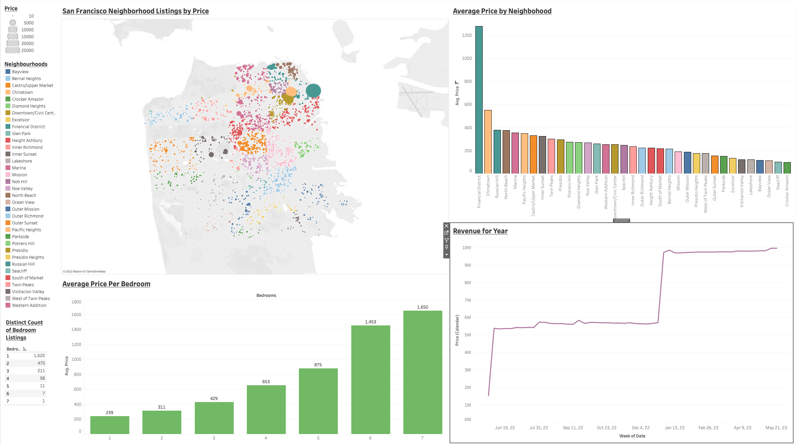

# About
Founded in 2007, Airbnb is the leading online platform that allows property owners (hosts) to rent out there spaces to guests, tourists, and travelers looking for a place to stay. Hosts offer unique stays and experiences that make it possible for guests to connect with local communities in a more authentic way. Prices vary according to cities, but this project will be focused on San Francisco's Airbnb properties. 

# Datasource
Data source can be found [here](http://insideairbnb.com/get-the-data/). I used June 2022's San Francisco data and combined listings, calendar, and reviews csv's into one and used an inner join on id. Combined dataset can be found [here](https://www.kaggle.com/datasets/toni342/tableau-full-project-san-francisco-june-2022).

# Data Visualizations
Data Visualizations can be found [here](https://public.tableau.com/app/profile/toni5386/viz/AirbnbSanFranciscoNeighborhoodAnalysis/FinalDashboard) on my Tableau Public.

